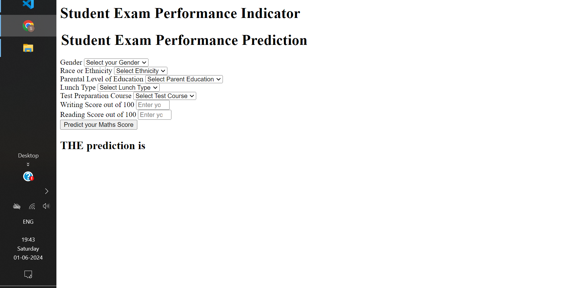
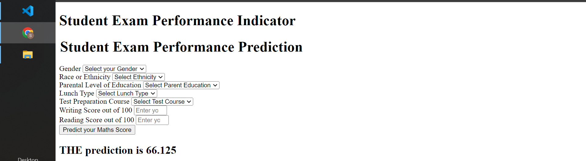
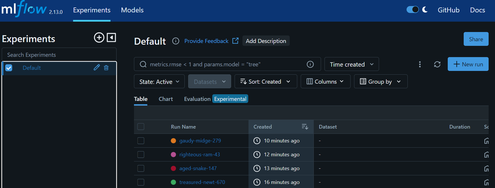
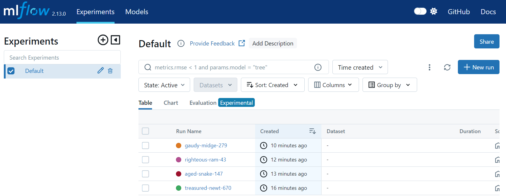

# End to End Data Science Project
#Student Exam Performance Indicator

Project Overview
This project aims to predict a student's math score based on various factors such as gender, race/ethnicity, parental level of education, lunch type, test preparation course, writing score, and reading score. The project uses MLOps tools like DVC for data versioning control and MLflow for tracking experiments, models, and deployment.

Table of Contents
->Introduction
->Dataset
->Project Structure
->MLOps Tools
1)DVC (Data Version Control)
2)MLflow
->Installation
->Usage
->Results
->Conclusion
->Contact

# 📊 Project Data Description

## 🗂️ Data Collection

- **Dataset Source**: [Students Performance in Exams](https://www.kaggle.com/datasets/spscientist/students-performance-in-exams?datasetId=74977)
- **Data Dimensions**: The dataset contains **1000 rows** and **8 columns**.

## 📋 Data Columns

1. **👤 gender**: Gender of the student (e.g., male, female)
2. **🌍 race_ethnicity**: Race/ethnicity group of the student (e.g., Group A, Group B, etc.)
3. **🎓 parental_level_of_education**: Highest level of education attained by the student's parents (e.g., high school, bachelor's degree)
4. **🥪 lunch**: Type of lunch received (e.g., standard, free/reduced)
5. **📚 test_preparation_course**: Participation in test preparation course (e.g., completed, none)
6. **🧮 math_score**: Score obtained in the math exam (dependent variable)
7. **📖 reading_score**: Score obtained in the reading exam
8. **✍️ writing_score**: Score obtained in the writing exam

## 🔍 Independent and Dependent Variables

- **Independent Variables (X)**: All columns except 'math_score'
  - 👤 `gender`
  - 🌍 `race_ethnicity`
  - 🎓 `parental_level_of_education`
  - 🥪 `lunch`
  - 📚 `test_preparation_course`
  - 📖 `reading_score`
  - ✍️ `writing_score`

- **Dependent Variable (y)**: 🧮 `math_score`

This dataset will be used to analyze and predict student performance in mathematics based on various demographic and educational factors.

## 🚀 Model Training and Evaluation

For this project, we trained and evaluated several regression models to predict student performance in mathematics. The models used are:

- **Linear Regression**
- **Lasso**
- **Ridge**
- **K-Neighbors Regressor**
- **Decision Tree**
- **Random Forest Regressor**
- **XGBRegressor**
- **CatBoosting Regressor**
- **AdaBoost Regressor**

### 📊 Performance Metrics

To assess the performance of these models, we used the following metrics:
- **Root Mean Squared Error (RMSE)**
- **Mean Absolute Error (MAE)**
- **R² Score**

### 🏆 Results

Here are the R² scores for each model:

| Model Name               | R² Score  |
|--------------------------|-----------|
| Ridge                    | 0.880593  |
| Linear Regression        | 0.880345  |
| CatBoosting Regressor    | 0.851632  |
| AdaBoost Regressor       | 0.849847  |
| Random Forest Regressor  | 0.847291  |
| Lasso                    | 0.825320  |
| XGBRegressor             | 0.821589  |
| K-Neighbors Regressor    | 0.783813  |
| Decision Tree            | 0.760313  |

These results indicate that the **Ridge** regression model performed the best, closely followed by **Linear Regression**.

## Introduction

Predicting student performance is a critical aspect of educational systems. By leveraging machine learning techniques, this project aims to provide insights into how various factors influence student performance, particularly in mathematics.

### Dataset

The dataset used in this project includes the following features:

->Gender: The gender of the student.
->Race/Ethnicity: The race or ethnicity of the student.
->Parental Level of Education: The highest level of education attained by the student's parents.
->Lunch Type: The type of lunch the student receives.
->Test Preparation Course: Whether the student completed a test preparation course.
->Writing Score: The student's writing score (out of 100).
->Reading Score: The student's reading score (out of 100).

  The target variable is the **Math Score**.

## Project Structure

Student-Exam-Performance-Indicator/
├── data/
│   ├── raw/
│   ├── processed/
│   └── DVCfile
├── notebooks/
│   └── EDA.ipynb
├── src/
│   ├── data_processing.py
│   ├── model_training.py
│   ├── model_evaluation.py
│   └── prediction.py
├── models/
├── reports/
│   └── report.html
├── dvc.yaml
├── mlflow/
│   ├── experiments/
│   ├── models/
│   └── mlflow.db
├── README.md
├── requirements.txt
└── setup.py

# MLOps Tools

## DVC (Data Version Control)

DVC is used for versioning datasets and machine learning models. It allows you to track data files and model files, enabling reproducibility and efficient collaboration in your machine learning projects.

**Benefits of DVC:**

->**Versioning**: Keep track of changes in data and models over time.
->**Reproducibility**: Ensure that experiments can be reproduced with the same data and model versions.
->**Collaboration**: Facilitate collaboration among team members by sharing data and model versions.

# MLflow

MLflow is used for managing the end-to-end machine learning lifecycle, including experimentation, reproducibility, and deployment. It tracks experiments, records models, and manages model deployment.

## Benefits of MLflow:

-> **Experiment Tracking**: Record and query experiments, including code, data, config, and results.
-> **Model Management**: Register, annotate, and deploy models from a centralized model repository.
-> **Reproducibility**: Ensure that experiments can be reproduced with the same parameters and data

# Installation

To install the necessary dependencies, run:

pip install -r requirements.txt

## Usage
1. **Data Processing**: Process the raw data and store the processed data.

 python src/data_processing.py

2. **Model Training**: Train the machine learning model.

 python src/model_training.py

3. **Model Evaluation**: Evaluate the trained model.

 python src/model_evaluation.py

4. **Prediction**: Make predictions using the trained model.

 python src/prediction.py

## Results

The model's performance is evaluated based on metrics such as Mean Absolute Error (MAE), Mean Squared Error (MSE), and R-squared (R²) score. Detailed results and visualizations are provided in the reports/report.html.

# Conclusion

This project demonstrates the application of MLOps tools like DVC and MLflow to efficiently manage the lifecycle of a machine learning project. By predicting student math scores, we gain valuable insights into factors that influence academic performance, which can be leveraged to improve educational outcomes.

<!-- 

# Mlflow

 -->

## Contact 
 
For any inquiries or further information, please contact:

Sahil Tiwari
Email: sahiltiwari1222@gmail.com
github:https://github.com/sahilTiwariiii

---

Feel free to explore the project, experiment with the data, and enhance the model. Your feedback and contributions are welcome!

---

Note: This README file provides a comprehensive overview of the project, highlighting the use of MLOps tools and the steps involved in the project workflow.

